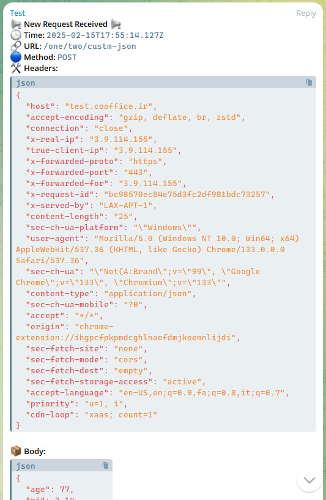

# php-network-check

> A simple PHP script to log incoming HTTP requests and send detailed reports via Telegram.

A lightweight PHP script that logs incoming HTTP requests, capturing details like method, headers, body, and file uploads. It sends real-time reports to a Telegram chat, making it ideal for developers and admins to monitor traffic, debug APIs, and track server activity. Easy to set up and customize for both development and production environments.

## Features

- Logs incoming HTTP requests (method, URL, headers, body, and file uploads).
- Sends logs to Telegram for real-time notifications.
- Handles CORS and OPTIONS requests gracefully.
- Easy-to-use setup for local or production environments.



## Requirements

- PHP 7.4 or higher.
- A Telegram bot and chat ID for receiving logs.

## Setup

### 1. Clone the repository

To get started, clone the repository to your local machine:

```sh
git clone https://github.com/BaseMax/php-network-check
cd php-network-check
```

### 2. Configure the bot and chat ID

Before running the script, make sure to replace the following placeholders in network.php:

- `$TELEGRAM_BOT_TOKEN`: Your Telegram bot's API token. You can create a bot and get the token from BotFather.
- `$TELEGRAM_CHAT_ID`: The chat ID where you want to send the logs. This could be your personal chat ID or a group chat. You can find it by using a Telegram Bot API method.

### 3. Start the PHP server

You can start the PHP built-in server with the following command:

```sh
php -S 0.0.0.0:9094
```

The server will start and listen for requests on port 9094.

## Usage

Once the server is up, any incoming HTTP request to this endpoint will trigger the logging function and send detailed logs to your specified Telegram chat.

### Example Network Report

Upon receiving a request, you will receive a message like this in your Telegram chat:

```
📢 New Request Received 📢
🕒 Time: 2025-02-15T17:55:14.127Z
🔗 URL: /one/two/custm-json
🔵 Method: POST
🛠 Headers: {
  "host": "test.cooffice.ir",
  "accept-encoding": "gzip, deflate, br, zstd",
  "connection": "close",
  "x-real-ip": "3.9.114.155",
  "true-client-ip": "3.9.114.155",
  "x-forwarded-proto": "https",
  "x-forwarded-port": "443",
  "x-forwarded-for": "3.9.114.155",
  "x-request-id": "bc98570ec84e75d3fc2df981bdc73257",
  "x-served-by": "LAX-APT-1",
  "content-length": "25",
  "sec-ch-ua-platform": "\"Windows\"",
  "user-agent": "Mozilla/5.0 (Windows NT 10.0; Win64; x64) AppleWebKit/537.36 (KHTML, like Gecko) Chrome/133.0.0.0 Safari/537.36",
  "sec-ch-ua": "\"Not(A:Brand\";v=\"99\", \"Google Chrome\";v=\"133\", \"Chromium\";v=\"133\"",
  "content-type": "application/json",
  "sec-ch-ua-mobile": "?0",
  "accept": "*/*",
  "origin": "chrome-extension://ihgpcfpkpmdcghlnaofdmjkoemnlijdi",
  "sec-fetch-site": "none",
  "sec-fetch-mode": "cors",
  "sec-fetch-dest": "empty",
  "sec-fetch-storage-access": "active",
  "accept-language": "en-US,en;q=0.9,fa;q=0.8,it;q=0.7",
  "priority": "u=1, i",
  "cdn-loop": "xaas; count=1"
}

📦 Body: {
  "age": 77,
  "pi": 3.14
}

📂 Files: "No files uploaded"
```

### Customization Options

- **CORS Headers:** By default, the script allows all origins, methods, and headers. You can restrict access by changing the CORS headers to suit your needs.
- **Request Handling:** The script also handles OPTIONS requests for preflight checks, returning a 200 OK response.
- **File Uploads:** If there are any files uploaded in the request, the script will log the name, type, and size of each file.

Copyright 2025, Max Base
